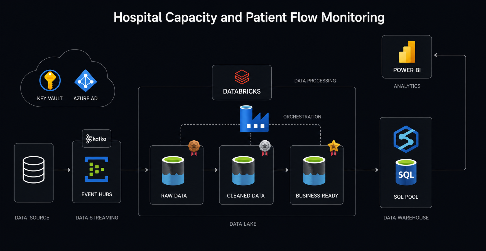
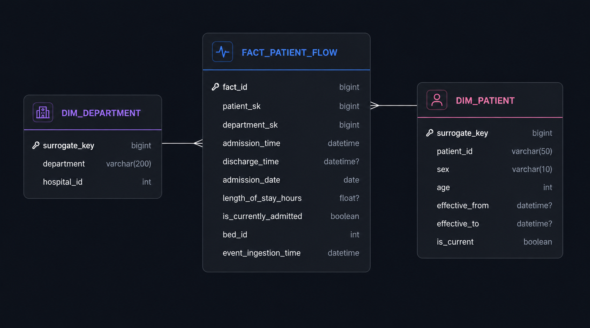
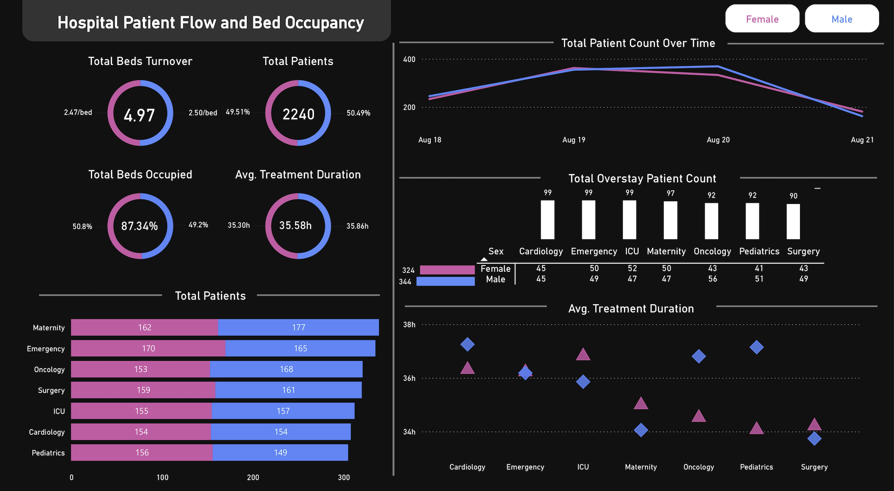

# Real-Time Hospital Patient Flow & Bed Capacity Analytics Platform


An enterprise-grade, real-time data engineering platform designed to resolve clinical capacity bottlenecks, track departmental overstays, and monitor hospital bed turnover. Built using a **Medallion Lakehouse Architecture (Bronze $\rightarrow$ Silver $\rightarrow$ Gold)** on **Azure Databricks**, **Delta Lake**, **Azure Synapse Dedicated SQL Pools**, and **Power BI**.

## 🏛️ System Architecture



The pipeline processes high-throughput clinical event streams to deliver near real-time operational metrics:

1. **Event Ingestion (Kafka / Event Hubs):** A Python-based clinical event generator produces real-time JSON-formatted event messages representing patient admissions, transfers, bed assignments, and discharges. **Azure Event Hubs** operates as the distributed Kafka broker.
2. **Lakehouse Medallion Architecture (Azure Databricks & ADLS Gen2):**
   * **Bronze Layer (Raw Ingestion):** Ingests streaming payloads directly into **Delta Lake** storage on ADLS Gen2, maintaining raw event fidelity.
   * **Silver Layer (Cleaning & Quality Enforcement):** Performs schema validation, deduplication, timestamp normalization, and data cleansing using PySpark structured streaming.
   * **Gold Layer (Business Aggregations & Dimensional Serving):** Computes core clinical KPIs (turnover intervals, departmental overstay risk, bed utilization rates) and stages structured data for warehouse ingestion.
3. **Data Warehousing & Serving (Azure Synapse Analytics):** Dedicated SQL Pools and optimized analytical views deliver sub-second analytical query performance.
4. **Executive Business Intelligence (Power BI):** A modern dark-mode operational dashboard connected to Synapse views, providing clinical decision-support metrics for hospital leadership.


## ⭐ Dimensional Modeling & Semantic Serving Layer

The Gold Layer data loaded into Azure Synapse Analytics implements a **Star Schema** with surrogate keys and dedicated analytical views designed for optimized BI querying performance:



### Fact & Dimension Entities
* **Fact Table (`fact_patient_flow`):** Transactional records tracking admissions, discharges, active admission status flags, bed allocations, length of stay, and ingestion timestamps.
* **Dimension Tables:**
  * `dim_patient`: Patient demographics (`sex`, `age`) with SCD Type 2 tracking (`effective_from`, `effective_to`, `is_current`).
  * `dim_department`: Department identifiers (`department`, `hospital_id`).

### Analytical Serving Views (Synapse → Power BI)
* `vw_bed_occupancy` & `vw_bed_turnover_rate`: Real-time bed occupancy percentages and turnover rates.
* `vw_patient_demographics` & `vw_department_inflow`: Active patient headcounts and department-level volume distribution.
* `vw_patient_volume_trend`: Temporal volume trends tracked over admission dates.
* `vw_overstay_patients`: Inpatient monitoring flagging stays exceeding clinical thresholds (> 50 hours).
* `vw_avg_treatment_duration`: Average length of stay and duration metrics across clinical departments.


## 📊 Executive BI & Clinical Operations



### Core Operational KPIs Monitored
* **Bed Turnover & Occupancy:** Real-time capacity utilization and bed availability across all inpatient units.
* **Overstay Patient Tracking:** Automated departmental alerts flagging patients exceeding standard Length of Stay (LOS) thresholds.
* **Patient Volume Inflow & Demographics:** Inflow tracking and capacity demand stratified by clinical department and patient demographics.
* **Average Treatment Duration:** Continuous monitoring of care delivery latency across specialized units (Cardiology, Oncology, ICU, Emergency, Surgery, Pediatrics, Maternity).


## 📁 Repository Structure

```plaintext
patient-flow-analytics-azure/
│
├── client_requirements/             # Project specifications and architectural assets
│   ├── Patient Flow & Bed Occupancy Analytics.pdf
│   ├── pipeline_diagram.png
│   └── dimensional_model.png
│
├── databricks_notebooks/            # Medallion processing (PySpark & Delta Lake)
│   ├── 01_bronze_rawdata.ipynb      # Event Hub stream ingestion to raw Delta
│   ├── 02_silver_cleandata.ipynb    # Schema validation, cleansing, and deduplication
│   └── 03_gold_transform.ipynb      # KPI calculation and analytical aggregation
│
├── power_bi/                        # BI reporting assets & exports
│   ├── Hospital_Dashboard.jpg
│   ├── Hospital_Dashboard.pdf
│   └── hospital_dashboard
│
├── simulator/                       # Real-time event generation
│   └── patient_flow_generator.py    # Python producer streaming synthetic clinical events
│
├── sql_queries/                     # Synapse DDL & Analytical Views
│   ├── sql_pool.sql                 # Dedicated SQL pool table definitions
│   └── sql_views_DDL.sql            # Aggregated analytical views supporting Power BI
│
├── .gitignore
└── README.md
```


## ⚙️ Technical Highlights & Engineering Decisions
- **Delta Lake ACID Guarantees:** Implemented Delta Lake on ADLS Gen2 to ensure transaction reliability, schema enforcement, and point-in-time recovery during streaming ingestion.
- **Decoupled Architecture:** Separated compute (Azure Databricks PySpark clusters) from storage (ADLS Gen2) and serving (Synapse SQL Pools) to scale ingestion and analytics independently.
- **Analytical View Optimization:** Pre-aggregated heavy window functions and KPIs within Synapse SQL views to eliminate compute bottlenecks on BI dashboard refreshes.
- **Resilient Ingestion:** Configured Kafka-compatible Event Hub consumer groups to support uninterrupted stream processing and checkpointing.
